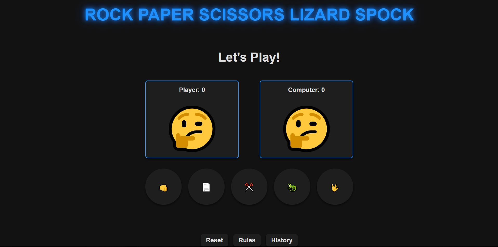
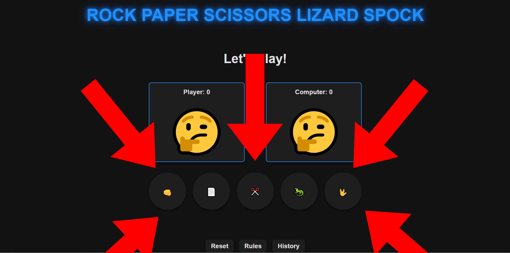
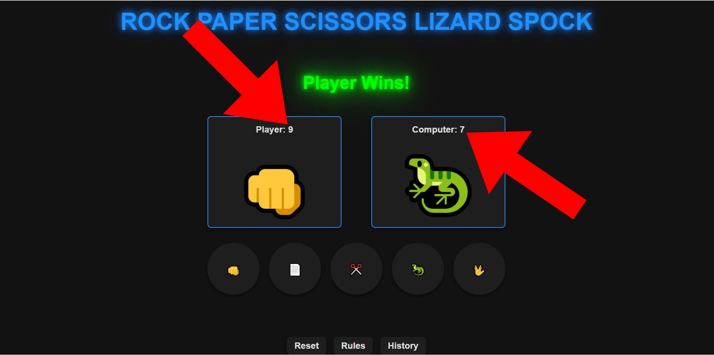
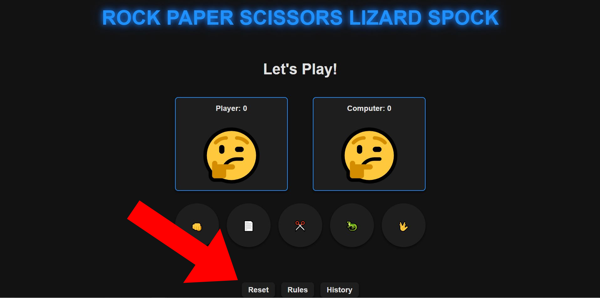
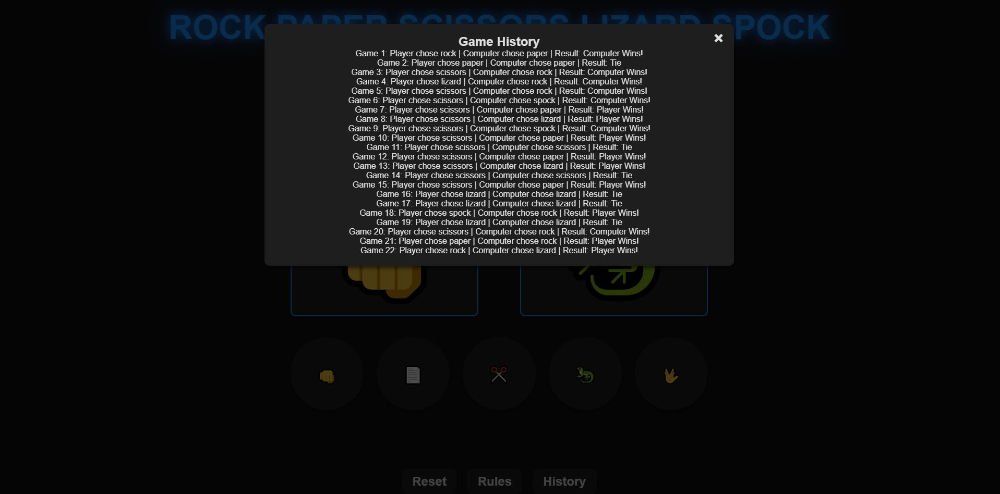
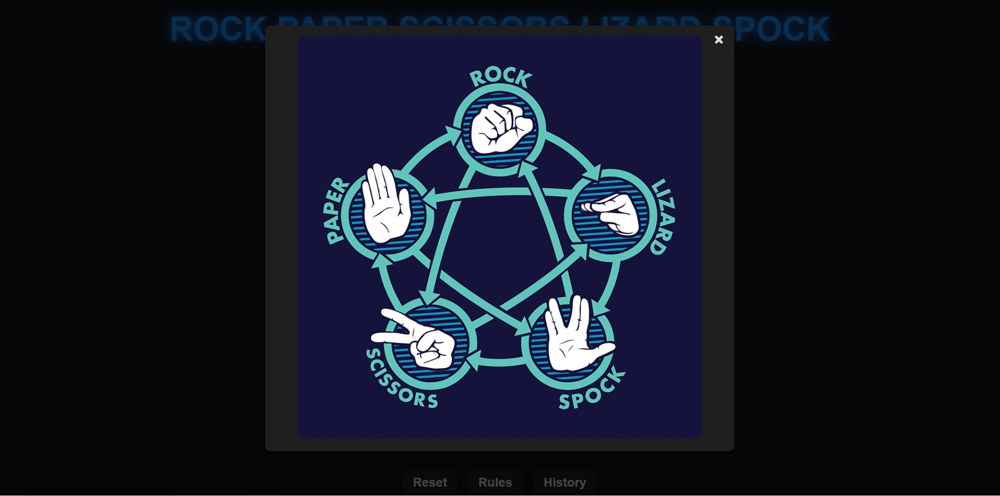
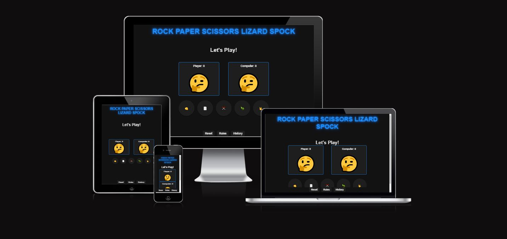

# Rock Paper Scissors Lizard Spock Game

Welcome to the **Rock Paper Scissors Lizard Spock** game! This interactive web-based game offers a fun twist on the classic Rock, Paper, Scissors game by adding Lizard and Spock to the mix. Play against the computer or challenge a friend, and see who comes out on top! The game is fully responsive and designed to be enjoyed on both mobile and desktop devices.

[**Deployment Link**](https://pauld95-git.github.io/RPSLS/)

---

## Table of Contents

- [Project Overview](#project-overview)
- [Features](#features)
- [Technologies Used](#technologies-used)
- [How to Use](#how-to-use)
- [Credits](#credits)
- [Bugs](#bugs)
- [Validator](#validator)
- [Deployment](#deployment)
- [Code Structure](#code-structure)

---

## Project Overview

The **Rock Paper Scissors Lizard Spock Game** is an expanded version of the classic Rock Paper Scissors game, featuring additional options: Lizard and Spock. The game follows the same basic rules but introduces new dynamics that create even more possibilities for how the game can unfold. 

### Objective:
- Challenge the computer or another player to a game of **Rock Paper Scissors Lizard Spock**.
- Choose one of the five options: Rock, Paper, Scissors, Lizard, or Spock, and compete against your opponent's choice.
- The game declares the winner based on the traditional and extended rules.

---

## Features

### 1. **Game Interface**
- A clean, minimalistic design that displays the player's selection, the computer's selection, and the result (win, lose, or draw).
- Responsive layout that adapts to both mobile and desktop screens.

### 2. **Choice Selection**
- The player selects one of five options: Rock, Paper, Scissors, Lizard, or Spock.
- Each choice is represented by a button with an associated icon, and users can click to make their choice.

### 3. **Result Display**
- After both the player and computer have made their selections, the result (win, lose, or draw) is displayed.
- A description of how the winner was determined (based on the game rules) is shown.

### 5. **Reset Button**
The **Reset** button allows users to reset the game completely, clearing the results and allowing them to start fresh.
- **How it helps**: It provides a quick way to clear the previous round's selections and results, giving users a clean slate to play again. This is especially helpful if a user wants to reset the game without refreshing the page or losing progress.

  
### 6. **History Button**
The **History** button displays the previous selections and results of the game, showing a record of all past rounds.
- **How it helps**: It allows players to review the outcomes of their previous games, adding a historical context to the gameplay. This is useful for players who want to track their performance over time or see how many games they have won or lost.

  
### 7. **Rules Button**
The **Rules** button opens a modal or a separate section that explains how the game works, including the extended rules for Rock, Paper, Scissors, Lizard, and Spock.
- **How it helps**: It provides users with a quick and easy way to understand the game mechanics, especially if they are unfamiliar with the Lizard and Spock additions. This feature ensures that all players know how to play and what the possible outcomes are.

### 8. **Mobile Responsive Design**
- The website layout and game controls adjust to various screen sizes, ensuring a smooth and enjoyable experience on both mobile devices and desktops.

---

## Technologies Used

- **HTML5**: Used for structuring the content and layout of the game.
- **CSS3**: Styling the game with responsive design to fit different screen sizes.
- **JavaScript**: Logic for the game, handling user interactions, random computer selection, and determining the winner.
- **Font Awesome**: For using iconography to represent Rock, Paper, Scissors, Lizard, and Spock.

---

## How to Use

### Playing the Game:
1. Open the **Rock Paper Scissors Lizard Spock** game in your browser.
2. Select one of the five available choices: Rock, Paper, Scissors, Lizard, or Spock.
3. The computer will also make its selection randomly.
4. The game will determine the winner based on the following rules:
   - **Rock** crushes **Scissors** and crushes **Lizard**.
   - **Paper** covers **Rock** and disproves **Spock**.
   - **Scissors** cuts **Paper** and decapitates **Lizard**.
   - **Lizard** eats **Paper** and poisons **Spock**.
   - **Spock** smashes **Scissors** and vaporizes **Rock**.
5. The result (win, lose, or draw) will be displayed.
6. Press the **Replay** button to start another round.

---

## Bugs

- No known bugs at the moment. All game mechanics are functioning as expected.

---

## Validator

- **HTML5 validation** passed with no errors.
- **CSS3 validation** passed with no errors.
- **JavaScript** was linted using **JSHint**, and no errors were found.

---

## Deployment

This website has been deployed to **GitHub Pages**. Here are the steps for deployment:

1. Push the project to a GitHub repository.
2. Go to the repository's **Settings**.
3. Under the **Pages** section, select the branch to deploy from (usually `main` or `master`).
4. The site will be available at the provided GitHub Pages URL.
5. The live game can be accessed [here](https://pauld95-git.github.io/RPSLS/).

---

## Credits
- **Rules Image**: https://www.akshaybahadur.com/post/rock-paper-scissors-lizard-spock
- **Icons for Game Choices**: Icons used for Rock, Paper, Scissors, Lizard, and Spock were sourced from [Font Awesome](https://fontawesome.com/).
- **Game Logic Inspiration**: The basic game mechanics are inspired by the classic Rock Paper Scissors game, with additional rules for Lizard and Spock, popularized by *The Big Bang Theory*.